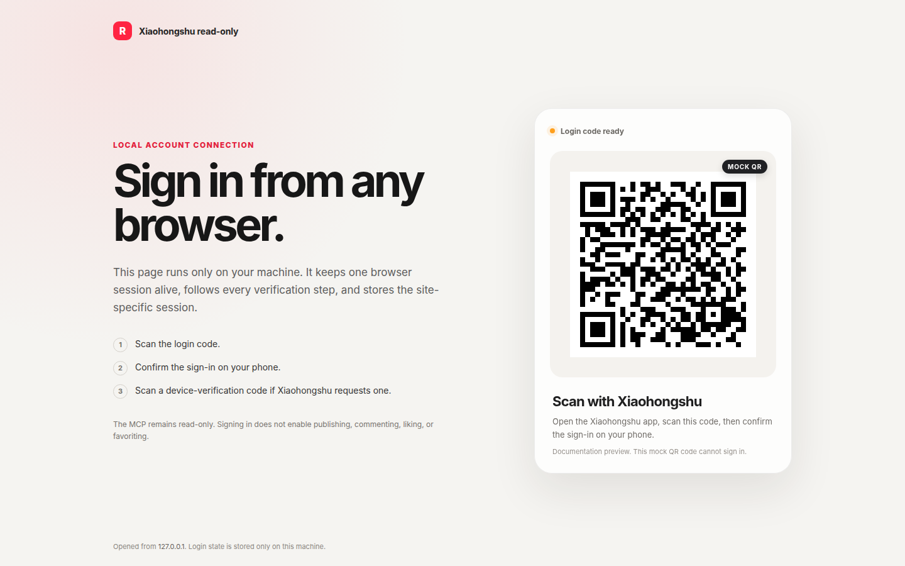

# 小红书 / RedNote MCP Server（只读版）

**简体中文** | [English](README.en.md)

[](https://github.com/sinmentis/xiaohongshu-mcp-readonly/actions/workflows/ci.yml)
[](https://github.com/sinmentis/xiaohongshu-mcp-readonly/actions/workflows/codeql.yml)
[](LICENSE)

这是一个只跑在本机的只读 MCP Server，支持小红书和 RedNote。可以接入
GitHub Copilot CLI、Claude Code、Codex CLI 和 Cursor，用 AI Agent 搜索公开
笔记、读取评论和查看用户主页。

> [!IMPORTANT]
> 这里只开放 6 个只读工具。不能发笔记、评论、回复、点赞、收藏，也不能读取通知
> 或删除 Cookie。平台仍然可能记录自动化浏览器的登录、搜索和浏览行为。



> 图里的二维码只是示意，不能登录，也不包含真实账号信息。实际登录页只在本机的
> `http://127.0.0.1:18060/login` 打开。

## 快速开始

需要 Go 1.25.12 或更高版本。建议使用专门的测试账号。

Linux 上有 systemd 用户会话时：

```bash
git clone https://github.com/sinmentis/xiaohongshu-mcp-readonly.git
cd xiaohongshu-mcp-readonly
./scripts/setup-local --site rednote --agent copilot
```

海外 RedNote 账号用 `--site rednote`，中国大陆小红书账号用
`--site xiaohongshu`。`--agent` 也可以设为 `claude`、`codex` 或 `none`。
脚本会完成编译、安装和启动，并按需注册 MCP 服务。

然后打开：

```text
http://127.0.0.1:18060/login
```

在 Copilot CLI 里运行 `/mcp`，然后直接说：

```text
用 xiaohongshu-readonly 检查一下我有没有登录。
```

服务会自动选择项目浏览器、系统 Chromium 或 Playwright Chromium。也可以设置
`XHS_BROWSER_BIN`，只使用自己管理的浏览器。项目浏览器下载会校验仓库固定的
SHA256。

## MCP 工具

| 工具 | 用途 |
| --- | --- |
| `check_login_status` | 检查当前账号是否已经登录。 |
| `get_login_qrcode` | 获取登录或设备验证二维码。 |
| `list_feeds` | 读取首页推荐。 |
| `search_feeds` | 搜索公开笔记。 |
| `get_feed_detail` | 读取笔记、媒体信息和评论。 |
| `user_profile` | 读取公开用户资料和可见笔记。 |

## 运行时要知道

- 浏览器操作会排队执行，默认最多等 1 分钟。
- 两次操作之间至少间隔 30 秒，并带少量随机延迟。
- 每个操作都有服务端超时，卡住会返回错误，不会无限等。
- 评论读取有数量和滚动速度限制，不适合无人值守的批量采集。
- 出问题先看 `curl http://127.0.0.1:18060/health`。

详细配置和排查：
[Copilot CLI](docs/copilot-cli.md) ·
[其他 AI Agent](docs/ai-agents.md) ·
[故障排查](docs/troubleshooting.md) ·
[HTTP 接口](docs/api.md) ·
[架构](docs/architecture.md) ·
[安全模型](docs/security-model.md) ·
[开发和提交代码](CONTRIBUTING.md)

## 安全与说明

Cookie 文件包含完整登录状态，请当成密码，不要上传、分享或写进日志。服务只监听
本机地址并检查 Host、Origin 和 JSON POST，但同一用户运行的本机进程仍在信任
范围内。安全问题请通过
[GitHub Security Advisories](https://github.com/sinmentis/xiaohongshu-mcp-readonly/security/advisories/new)
私下报告。

这是 [`xpzouying/xiaohongshu-mcp`](https://github.com/xpzouying/xiaohongshu-mcp)
的非官方修改版，与小红书、RedNote 及其运营方无关。使用者需要自行承担账号、
数据、访问频率和合规责任。

项目使用 Apache License 2.0。上游来源、协议和署名见
[LICENSE](LICENSE)、[NOTICE](NOTICE) 和 [docs/upstream.md](docs/upstream.md)。
